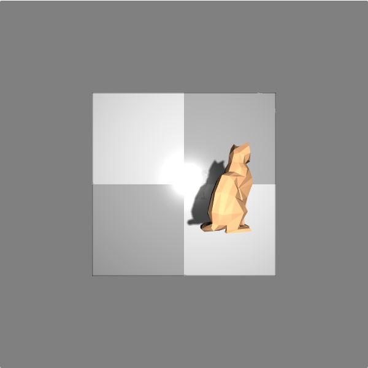
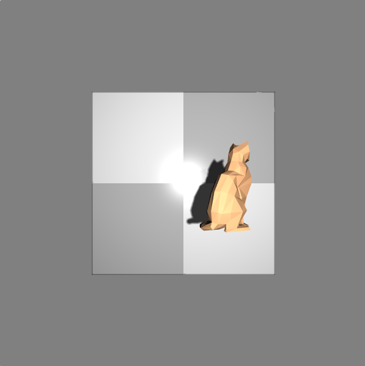

# 光照模型的设计

## 基本原理

> 本程序中使用了简化版的Phong光照模型。Phong光照模型的核心思想是一个点的光照是由其漫反射、镜面反射和环境光相叠加而成的。

由于Phong光照模型中对于镜面反射的反射向量求取较为耗时，因此参考Blinn-Phong模型，采用了*光源-片元向量和片元-相机向量的中间向量点乘片元法向量*的做法，从实际效果来看也较为理想。

## 设计思路

> 光照这部分内容较为基础。我在程序中仅设置了一个点光源和一个环境光。根据环境光的性质，环境光只需在最后阶段简单地加在片元颜色值上即可。点光源则需要具体计算。在提供的OBJ模型文件中提供了各顶点的法向量，将其传入顶点着色器，顶点着色器插值后传入片元着色器。

但是值得注意的是，模型中的顶点法向量是没有考虑物体运动的。由于我们要对模型进行缩放、平移等运动，因此在传入片元着色器前，应当对其进行变换。进行变换的方式也很简单，只需求出世界矩阵的逆转置，与法向量相乘即可。

此后主要进行了以下操作：

- 片元着色器对插值后的法向量单位化
- 从纹理中取出该片元漫反射颜色
- 计算出光源-片元向量和片元-光源向量的中间向量
- 让中间向量和法向量点乘，求出镜面炫光
- 将镜面反射、漫反射和环境光叠加，得到片元颜色

### 设计中遇到的问题

#### 阴影应该作用在哪一项上？

由于Phong模型是局部光照模型，因此其设计上并没有过多考虑阴影的影响，网上的文章也大多只实现了Phong光照模型或者阴影。那么阴影究竟应该叠加在哪一项上呢？显然，阴影不能叠加在环境光上。因此，我认为只有两种可能：

1. 阴影叠加在漫反射项上
2. 阴影叠加在漫反射+镜面反射项上

为此我做了一下对比：





可以看到，阴影叠加在漫反射+镜面项后，阴影颜色明显变深了，并无法再看到阴影中的倒影。从常理上说，我们更倾向于第一种情况——现实中阴影下的镜面还是能看到倒影的。这主要是由于光经过镜面反射后照到物体形成的。经过上述分析，我们最终采用了第一种方案，阴影仅对漫反射起作用。

#### 是否要考虑光线的衰减？

在上一次作业中，我没有考虑光线的衰减。这一设计的最明显好处是可以使用一套代码实现近似的点光源和平行光效果。并且实际上在程序中控制衰减因子还是挺困难的——很容易过曝或是过暗。

但是这一次，还是加入光线的衰减比较好。我们定义光线的衰减为：
$$
light*=\frac{1}{0.00005d^2}
$$
在测试中，发现效果较好，在合理的范围内移动光源不会发生明显的过曝效果。

## 具体实现

首先我们需要设定各种光的参数，包括环境光、点光源的颜色等。

```JavaScript
var light_uniform={
  uLightPos:[-10,10,-120],
  u_lightColor:[1,1,1,1],
  texelSize:1024,
  uShadow_type:false
}；
var board_uniform={
  //...
  v_Color:[1,1,1,1],
  u_ambient:[0.2,0.2,0.2,1],//环境光
  u_specular:[1,1,1,1],//镜面反射
  u_shininess:120,
  u_mirrorWeight:0.2,
  u_mirrorTexture:0
};
//...
```

然后只需要在着色器中取出这些信息，求出中间向量（半角向量），求点积，最后混合叠加即可。

```GLSL
void main(){
	vec4 diffuseColor = texture2D(u_texture,v_texcoord);	//漫反射颜色
	//...
	vec3 normal=normalize(v_normal);	//法向量
    vec3 surfaceToLightDirection=normalize(v_surfaceToLight);	//光源-片元向量
    vec3 surfaceToViewDirection = normalize(v_surfaceToView);	//片元-摄像机向量
    //半角向量
    vec3 halfVector = normalize(surfaceToLightDirection + surfaceToViewDirection);
    float light = dot(normal,surfaceToLightDirection);	//漫反射系数
    float specular = dot(normal, halfVector);	//镜面反射系数
    //...
    gl_FragColor.rgb = diffuseColor.rgb*light;    //漫反射项   
    gl_FragColor.rgb *= visibility;   //阴影覆盖在漫反射项
    //镜面反射
    gl_FragColor.rgb += mix(specular*u_specular,mirrorColor,u_mirrorWeight).rgb;
    float d=length(v_surfaceToLight);
    gl_FragColor.rgb/=(0.00005*d*d);	//衰减
    gl_FragColor += diffuseColor*u_ambient; //环境光项
}
```

