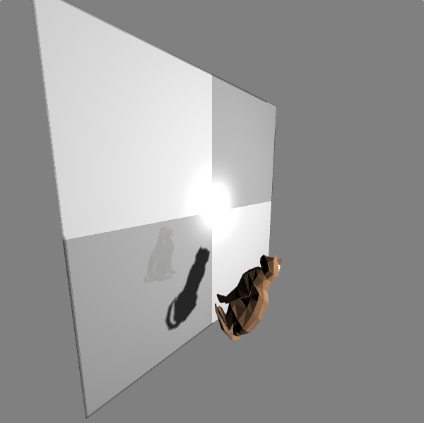

# 概述

> 本次作业与前几次不同，我没有使用Vue.js，但使用了轻量级WebGL辅助库TWGL。TWGL是非常底层的WebGL辅助库，仅是对WebGL常用指令和矩阵计算库的封装，与Three.js等三维API相比，具有很高的自由度，对于学习相当合适。本作业中主要使用TWGL来维护缓冲区、纹理和全局变量。不使用Vue.js的原因主要是由于Vue.js在数据结构上对原有JavaScript对象进行了一些修改，不便于TWGL发送变量数据。

考虑到Web浏览器对本地文件的访问安全性限制，我在本程序地纹理贴图上做了一些取巧的设计。我没有使用图片文件作为贴图，而是使用了两种纹理（也可以认为是三种，详见后文），分别是阴影纹理和镜面反射的纹理。这两种纹理都不需要提供图片文件，但经过合理的设计，却能提供比静态图片更为真实的视觉效果。

此外，在交互上我们还设计了跟踪球和点击选中模型的效果。跟踪球负责实现相机的漫游（加入鼠标滚轮事件的侦听以实现z轴移动）。点击选中模型功能用于实现模型在世界坐标系中的平移。这二者都通过向量的变换从屏幕坐标映射到世界坐标，详见后文。整体的运行效果如下：

如上图所示。首先可以看到使用了黑白相间的纹理填充的银幕[^1]，其中心点是点光源形成的镜面炫光。类似的镜面炫光在银幕前的黄色猫模型[^2]上也能看到。猫模型挡在点光源和银幕之间，因此形成了阴影。阴影使用4倍超采样抗锯齿，边缘较为柔和。同时，银幕本身还具有一定的镜面效果，这是通过将摄像机放置在银幕背面，并进行一些参数调整后得到的纹理。同时模型本身还支持旋转、缩放等操作。

[^1]: 以下简称“银幕”

[^2]: 以下简称“猫模型”