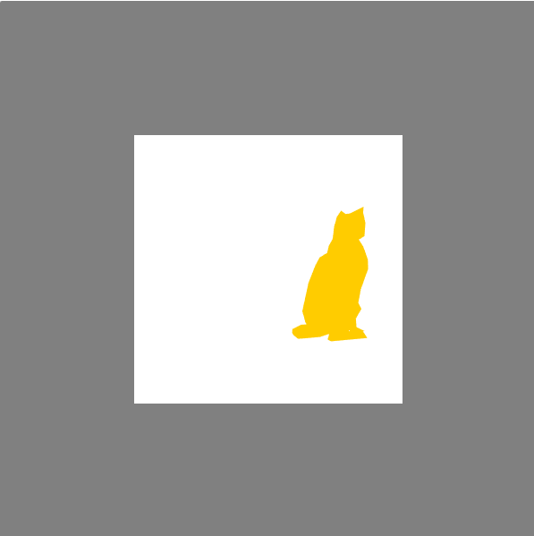

# 模型的点选和平移

## 基本原理

### 点选

> 模型的点击选中也是我们常常能看到的功能，在3D绘图软件和游戏中都有很广泛的应用。一般来说，实现它的方式有两种，一种是射线选择法，另一种则是我们使用的在帧缓存中存储特有颜色或id的方法。

射线选择法的基本原理就是，当点选某个像素时，我们看作从观察点向该方向发出一条射线。这条射线与哪个模型相交，就等于选中了哪个模型。射线选择法被许多著名的3D库使用，包括Three.js。射线选择法的好处是比较通用，但实现起来需要判断射线和片元的交点，比较繁琐。

我们使用的方法是在用户点击画布时，离屏渲染一张图片，顶点着色器和实际显示所用的一致，片元着色器仅仅为片元涂上给定的颜色。通过`gl.readPixels`方法，就可以读出当前鼠标点击的位置的颜色，进而判断点中了什么模型。此时帧缓存中的图像如下图所示。



### 平移

选中模型后就需要平移。最简单的做法是，将鼠标在x,y轴上的移动直接映射到模型的x,y轴平移上。但是我们的视点会移动，当其朝向不再朝向正z轴方向时，这一移动就会与用户的心理预期不符。如何修正这种偏移呢？我们使用投影-视图-世界-模型矩阵的乘积的逆矩阵，与鼠标移动的向量相乘，得到的值作为模型的平移参数。这样做的好处是，不论视点如何变化，用户的鼠标平移都会在屏幕上表现得方向一致。

## 设计思路

本事件的流程图如下：


@flowstart

st=>start: 鼠标点击
e=>end: 结束
render=>operation: 使用hit着色器渲染场景
frame=>inputoutput: 输出到帧缓存
cal_xy=>operation: 换算出帧缓存中对应的坐标
get_color=>inputoutput: 从帧缓存中取出颜色
cond=>condition: 颜色=猫的颜色？
hit_cat=>operation: 点中猫
miss=>operation: 没点中

st->render->frame->cal_xy->get_color->cond
cond(yes)->hit_cat->e
cond(no)->miss->e
@flowend

加上跟踪球后的流程如图：


@flowstart

st=>start: 鼠标点击
e=>end: 结束
cal_xy=>inputoutput: 计算出鼠标移动dx,dy、当前坐标x,y
is_hit=>subroutine: 检查当前是否命中猫模型
cond=>condition: 选中猫？
move_cat=>operation: (dx,dy,0)与逆矩阵invMat做乘法，算出正确的平移参数
change_world=>inputoutput: 对猫模型世界矩阵做修改，发送到着色器
track_ball=>operation: 根据虚拟跟踪球，求出dz
cal_axis=>operation: 用(dx,dy,dz)求出旋转轴和角度
change_camera=>inputoutput: 对相机位置进行修改，发送到着色器

st->cal_xy->is_hit->cond
cond(yes)->move_cat->change_world->e
cond(no)->track_ball->cal_axis->change_camera->e
@flowend

属于基本的流程控制和事件侦听，此处不过多叙述。

## 具体实现

顶点着色器和主着色器共用代码，因此略过。片段着色器的代码如下：

```GLSL
precision mediump float;
uniform vec4 v_Color;

void main()
{
	gl_FragColor=v_Color;
}
```

其实十分类似产生阴影深度的着色器代码，只是改为附上颜色罢了。

接下来是JavaScript中事件侦听的代码：

```JavaScript
//鼠标点击事件
canvas.onmousedown=function(e){
      var bbox = canvas.getBoundingClientRect();
      var x = event.clientX - bbox.left;
      var y = canvas.height- (event.clientY - bbox.top);
      console.log(x,y);
      twgl.bindFramebufferInfo(gl,fbi2);
      var readout=new Uint8Array(1*1*4);
      //绘制hit帧
      twgl.bindFramebufferInfo(gl,fbi2);
      gl.clear(gl.COLOR_BUFFER_BIT | gl.DEPTH_BUFFER_BIT);  
      gl.useProgram(hit_programInfo.program );
      twgl.setUniforms(hit_programInfo,light_uniform);
      twgl.setBuffersAndAttributes(gl, hit_programInfo, catBufferInfo);
      twgl.setUniforms(hit_programInfo, cat_uniforms);
      twgl.setUniforms(hit_programInfo, projection_uniforms);
      twgl.setUniforms(hit_programInfo, view_uniforms);
      twgl.drawBufferInfo(gl, catBufferInfo);

      twgl.setBuffersAndAttributes(gl,hit_programInfo,boardBufferInfo);
      board_uniform.uWorld=twgl.m4.setTranslation(twgl.m4.identity(),[0,0,50]);
      twgl.setUniforms(hit_programInfo, board_uniform);
      twgl.setUniforms(hit_programInfo, projection_uniforms);
      twgl.setUniforms(hit_programInfo, view_uniforms);
      twgl.drawBufferInfo(gl,boardBufferInfo);
      gl.readPixels(x,y,1,1,gl.RGBA,gl.UNSIGNED_BYTE,readout);
      console.log(readout);
      if(is_cat(readout)){
            mouseFlag=true;
            catMove=true;
            lastMousePosX=x;
            lastMousePosY=y;
            cat_uniforms.u_texture=tex3;
      }else{
            mouseFlag=true;
            trackBall=true;
            lastMousePosX=x;
            lastMousePosY=y;
      }
      twgl.bindFramebufferInfo(gl,null);
}

//鼠标滚轮事件
canvas.onmousewheel=function(event){
      console.log(event);
      event.preventDefault();
      var dy=event.deltaY;
      camera_uniform.u_viewWorldPosition=twgl.m4.transformPoint(twgl.m4.translate(twgl.m4.identity(),[0,0,dy*-0.1]),camera_uniform.u_viewWorldPosition);
    };

//鼠标移动事件
canvas.addEventListener("mousemove",function(event){
    if(!mouseFlag) return;
    var bbox = canvas.getBoundingClientRect();
    var x = event.clientX - bbox.left;
    var y = canvas.height- (event.clientY - bbox.top)*(canvas.height/bbox.height);
    var dx=x-lastMousePosX;
    var dy=y-lastMousePosY;
    var ratio_x=(x-lastMousePosX)/canvas.width;
    var ratio_y=(y-lastMousePosY)/canvas.height;

    if(catMove){
        var offset=twgl.m4.transformPoint(invMat,[0,0,0.01]);
        offset=twgl.v3.subtract(twgl.m4.transformPoint(invMat,[dx,dy,0.01]),offset);
        if(light_uniform.uShadow_type){
            twgl.v3.divide(offset,[300,300,300],offset);
        }
        changeCatLocation(offset);
        console.log(ratioX,ratioY,offset);
    }else{
        var r_x = 2*x * (canvas.width/bbox.width)/canvas.width-1;
        var r_y = 2*y/canvas.height-1;
        var last_rx=2*lastMousePosX*(canvas.width/bbox.width)/canvas.width-1;
        var last_ry=2*lastMousePosY/canvas.height-1;
        var ans = mouseMotion(r_x,last_ry,last_rx,r_y);
        camera_uniform.u_viewWorldPosition=twgl.m4.transformPoint(twgl.m4.axisRotate(twgl.m4.identity(),ans.axis,3*ans.angle),camera_uniform.u_viewWorldPosition);
    }

    lastMousePosX=x;
    lastMousePosY=y;

});
```

