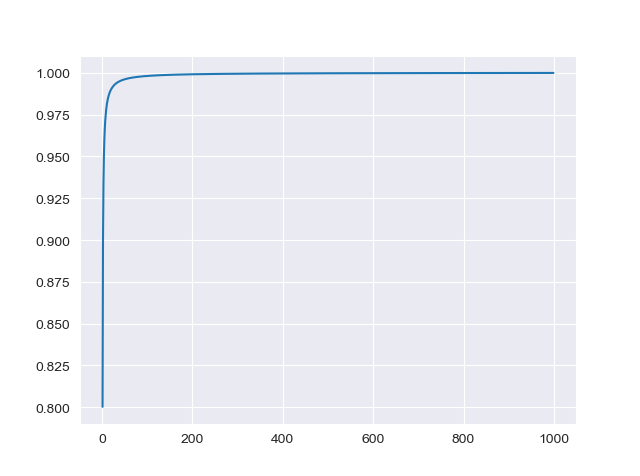
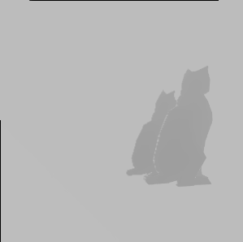
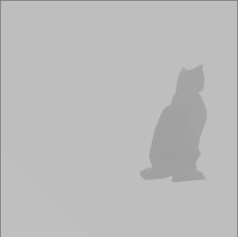
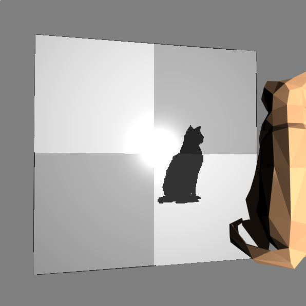
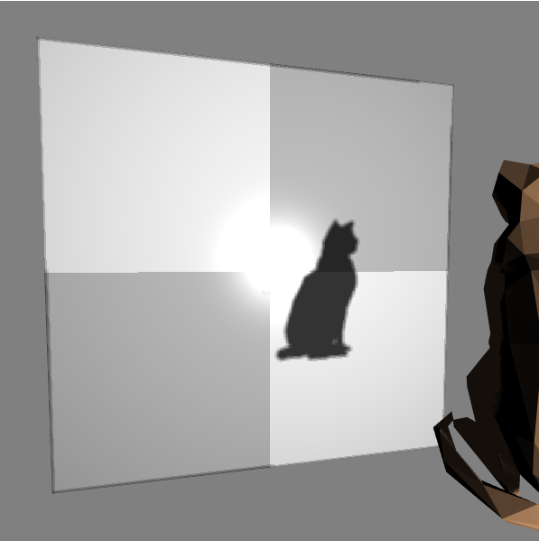

# 阴影贴图

## 基本原理

使用传统的方法实现阴影效果的基本思想是：*太阳看不见阴影*。


@flowstart

st=>start: 开始
e=>end: 结束
put_camera1=>operation: 照相机放在光源位置
depth=>operation: 算出片元深度
frame_buffer1=>inputoutput: 将深度映射值存入帧缓存
put_camera2=>operation: 照相机放在观察者位置
cal_xy=>operation: 算出该片元在照相机的视角下，对应的x,y,z
get_depth=>inputoutput: 从帧缓存中读取对应x,y的深度值depth
cond=>condition: Z>depth?
in_shadow=>operation: 当前片元在阴影中
out_shadow=>operation: 当前片元不在阴影中

st->put_camera1->depth->frame_buffer1->put_camera2->cal_xy->get_depth->cond
cond(yes)->in_shadow->e
cond(no)->out_shadow->e

@flowend


如图所示，如果将照相机放在光源位置，那么照相机所看到的即为光源所看到的场景。那么我们只要找出在这个场景中，光源看不到的片元，就是被阴影覆盖的片元。上述操作可以通过深度值来实现。具体的流程可见上图。

## **设计思路**

由于阴影数据在镜面贴图和显示中都需要使用，因此必须首先计算。阴影贴图的着色器中，严格意义上只需要将坐标变换到正确位置，然后把z值保存即可。但为了调试方便，我还是为片元附上了颜色。

### 精度问题

在最初调试时，片元的`gl_FragColor`的RGB值为颜色，W值为深度。但发现精度不足。理论上8位浮点数 $[0,\frac{255}{256}]$ 能存放256位深度，但是实际上由下图可知，绝大部分[^1]深度落在`0.01`的范围上。因此导致精度不足，阴影无法正常显示。于是使用32位数（RGBA）表示深度，实验发现效果良好[^2]。




### 偏移问题

处理了精度问题，可以保证不会出现大部分深度值落在1上的问题。但是上述方法并不能实际解决阴影映射的问题。由于浮点数转化过程中的问题，会导致存储在RGBA中的深度值无法与矩阵计算出的片元-光源距离直接作相等比较，导致图形学中常见的马赫带或其他问题。在这里我遇到的问题是片元-光源距离始终大于深度值，可以通过下面两张图分析看出。






这时可以通过添加固定的偏移量的方法，消除这一误差。对于透视投影，我们选择了`0.00004`作为偏移量，实验结果比较理想。

### 软化阴影

通过上述步骤得到的阴影贴图，在实际显示的着色器中应用后，效果如下：



可以发现，阴影有着很明显的锯齿，过渡非常不均匀。这主要是由于片元中的坐标值是连续插值得到的，而纹理数据却是离散的这一矛盾而产生的。我们可以通过增加帧缓存的大小并通过加入超采样的方式，来计算出更加柔和真实的阴影。下图是增加超采样后的阴影效果。



我使用了非常简单的超采样算法。首先，设定帧缓存大小到`1024*1024`，其宽高都大约是显示分辨率的2倍。在片元着色器中，使用一个循环，计算出当前片元周围的16个像素点的深度值，换算出对应的阴影值，求其均值作为当前片元的阴影值。

### 局限性

> 通过这种方式得到的阴影，永远都只能是硬阴影。

软阴影是由于光源具有大小而产生的。例如，现实生活中的日光灯，其光源形状是线性的长条，那么在其正下方的物体应该会产生许多较浅的阴影，而不是一个很深的阴影，因为在很大的范围内，日光灯都只有一部分能照到物体。但在我们的实现中，光源仅仅是摄像机放置的位置上的一个无穷小的点，点是没有大小的，因此对于所有片元都只有能照到和不能照到两种可能性。我们可以改变超采样算法，可以改变阴影覆盖的权重，但不能从根本上解决问题。使用光线追踪技术可以从根本上消灭这一问题。

## 具体实现

首先看生成深度数据的着色器。

```GLSL
//顶点着色器
attribute vec4 vPosition;

uniform mat4 uModel;	//模型变换矩阵
uniform mat4 uWorld;	//世界变换矩阵
uniform mat4 uView;		//视口变换
uniform mat4 uProjection;	//投影变换

void main()
{
	gl_Position = uProjection*uView*uWorld*uModel*vPosition;	//直接计算坐标即可
}
```


```GLSL
//片元着色器
precision mediump float;
uniform vec4 v_Color;

void main()
{
    const vec4 bitShift = vec4(1.0, 256.0, 256.0*256.0, 256.0*256.0*256.0);
    const vec4 bitMask = vec4(1.0/256.0, 1.0/256.0, 1.0/256.0, 0.0);
    vec4 rgbaDepth = fract(gl_FragCoord.z * bitShift);
    rgbaDepth -= rgbaDepth.gbaa * bitMask;
    gl_FragColor=rgbaDepth;
}
```

实现的代码很简单，主要是通过给定变换矩阵算出顶点的坐标，在片元着色器中将深度值存入RGBA表示的片元颜色中。

再来看绘制实际显示的图像的片元着色器：

```GLSL
void main(){
	//...
	//计算出当前片元对应深度数据的坐标(-1,1)=>(0,1)
	vec3 shadowCoord = (v_PositionFromLight.xyz/v_PositionFromLight.w)/2.0 + 0.5;
	//...
	//计算当前片元阴影值
	vec4 rgbaDepth;
    float shadows=0.0;
    float depth;
    for(float y=-1.5;y<=1.5;y+=1.0){
        for(float x=-1.5;x<=1.5;x+=1.0){
        	//从深度数据纹理中提取并还原出深度数据
            rgbaDepth=texture2D(u_ShadowMap, shadowCoord.xy+vec2(x,y)*(1.0/texelSize));
            depth = unpackDepth(rgbaDepth);
            //不同投影方式需要不同的偏移值
            if(!uShadow_type)
            	//如果当前片元深度比取出的深度数据大，则在阴影中
                shadows+=(shadowCoord.z > depth + 0.00004 ) ? 0.0 : 1.0;
            else
                shadows+=(shadowCoord.z > depth + 0.002 ) ? 0.0 : 1.0;
        }
    }
    shadows/=16.0;	//求均值
    //...
    gl_FragColor.rgb *= shadows;   //阴影覆盖在漫反射项
    //...
}
```

在WebGL的实现上，首先需要创建一个帧缓存，并把纹理绑定给全局变量：

```JavaScript
const attachments = [
        { format: gl.RGBA, type: gl.UNSIGNED_BYTE, min: gl.LINEAR },
        { format: gl.DEPTH_COMPONENT16 },
];
fbi = twgl.createFramebufferInfo(gl,attachments,1024,1024);
light_uniform.u_ShadowMap=fbi.attachments[0];
```

在渲染时，先切换到对应着色器程序，绑定帧缓存并绘图。绘图完成后还原帧缓存绑定，再使用主着色器程序就可以访问到纹理了。

```javascript
function render(){
      	//...
        //绘制阴影
        twgl.bindFramebufferInfo(gl,fbi);
        gl.clear(gl.COLOR_BUFFER_BIT | gl.DEPTH_BUFFER_BIT);
        gl.useProgram(shadow_programInfo.program);
        //...
        twgl.setUniforms(shadow_programInfo, shadow_uniform);
        twgl.setBuffersAndAttributes(gl,shadow_programInfo,boardBufferInfo);
        twgl.drawBufferInfo(gl,boardBufferInfo);

        twgl.setBuffersAndAttributes(gl, shadow_programInfo, catBufferInfo);
        twgl.drawBufferInfo(gl, catBufferInfo);
        
		//...
        //绘制可见帧
        twgl.bindFramebufferInfo(gl,null);
        gl.clear(gl.COLOR_BUFFER_BIT | gl.DEPTH_BUFFER_BIT);
        gl.useProgram(programInfo.program);
        
        twgl.setUniforms(programInfo,light_uniform);
        //...
        twgl.setBuffersAndAttributes(gl, programInfo, catBufferInfo);
        twgl.drawBufferInfo(gl, catBufferInfo);
        
        twgl.setBuffersAndAttributes(gl,programInfo,boardBufferInfo);
        twgl.drawBufferInfo(gl,boardBufferInfo);
		
		//...
       	requestAnimationFrame(render);
    }
```


[^1]: 根据实验约有75%的值落在$[0.99,1]$区间上，98.5%的值重复了
[^2]: 在检查的1000个样本中，没有深度数据重复