
<b>Flink学习（一）之流处理基础</b>

​        在学习flink之前，我们首先来 ~~回顾~~（预习）一下流处理的一些基础知识。

### 数据流图

​        数据流图用于描述操作之间的数据流向，通常表示为有向图。其中节点表示一个操作或者一个任务，边表示数据依赖关系。操作是数据流应用程序的基本功能单元。它们使用输入中的数据，对它们执行计算，然后将数据生成到输出以进行进一步处理。没有输入端的操作叫做source，而没有输出端口的操作称为sink。数据流图必须至少具有一个source和一个sink。

​        数据流图分为<b>逻辑图</b>和<b>物理图</b>，其中逻辑图如图1所示，主要展现了整个流处理的逻辑，其中节点代表一个操作。如果我们要执行一个数据流程序，需要先将其转化为物理图。在物理图中，需要引入并行度的概念，节点不再代表操作，而是代表一个可执行的具体任务，如图2所示。

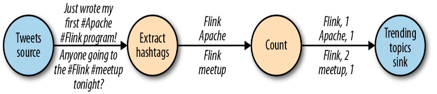

图1

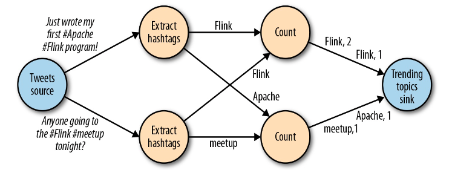

图2

### 分区

​        数据和操作都可以分区。数据分区使得处理大数据成为可能，它通过将大规模数据分区后交给不同的计算节点来处理。操作分区可以让来自不同操作的任务并行地对相同或不同的数据执行计算，操作分区可以更好的利用集群资源。

### 数据交换策略

节点间的数据交换存在以下四种方式：

* 直连交换策略(Forward)。数据从一个任务传到另一个任务
* 广播交换策略(Broadcast)。一个节点将数据广播给后续的每一个节点
* 基于键的交换策略(Key-based)。每个数据都有一个唯一的键值，基于键的交换策略对数据使用hash映射后传递到后续的不同节点，该方法可以确保键相同的数据一定被传递到相同的任务
* 随机交换策略(Random)。随机将数据传到后续节点中

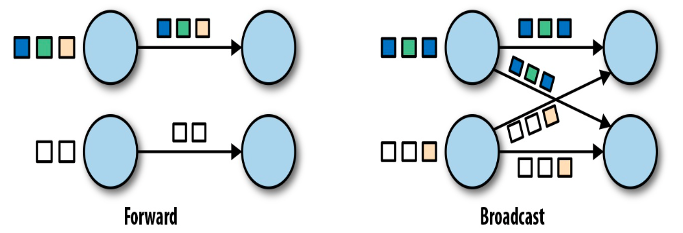

图3

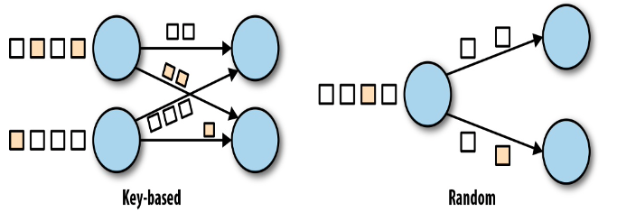

图4

### 吞吐量和等待时间

​		由于流数据可能是无止尽的，因此不能像批处理那样使用总共执行的时间来衡量性能。我们主要使用吞吐量和等待时间来表达流数据处理的性能要求。

​    	等待时间：一个事件从输入到执行结束后输出的时间间隔。

​		吞吐量：系统在单位时间能处理的事件数目。

​    	等待时间和吞吐量并不是独立的。如果事件在数据处理管道中花费很长时间（等待时间长），那么我们就无法轻易确保高吞吐量。同样，如果系统的容量较小（吞吐量小），则事件将被缓冲，必须等待前面的事件处理完才能处理当前事件，大大增加等待的时间。

### 数据流操作

​        操作可以是无状态的，也可以是有状态的。无状态操作不会维持任何内部状态。即，事件的处理不依赖于过去看到的任何事件，并且不保留任何历史记录。无状态操作易于并行化，因为事件可以彼此独立地处理，也可以与到达顺序无关地进行处理。而且，在发生故障的情况下，无状态操作可以简单地重新启动并从中断处继续进行处理。相反，有状态操作会维护之前收到的事件的信息。此状态可以通过传入事件进行更新，并且可以在将来事件的处理逻辑中使用。有状态的流处理应用程序对并行化和以容错方式进行操作更具挑战性，因为在发生故障的情况下，状态需要进行有效的划分并可靠地恢复。

* 输入与输出操作：流处理器与外部系统进行通信，可以接收外部数据或者为外部系统产出数据
* 转换操作：转换操作是独立处理每个事件的单遍操作。能够接受多个输入产出多个输出。（图5）

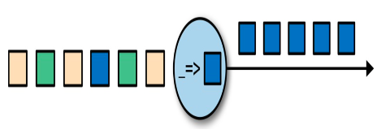

图5

* 滚动聚合：滚动聚合是针对每个输入事件不断更新的聚合。例如求和、最小最大值等，对于每个输入事件都会连续改变，滚动聚合是有状态的。（图6）

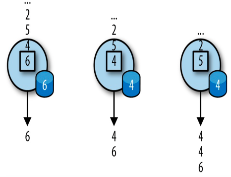

图6

* 窗口操作：从无限的事件流中连续创建有限的事件集，称为“桶”，然后让我们对这些有限集执行计算。通常会根据数据属性或时间将事件分配给存储桶。为了正确定义窗口运算的语义，我们需要确定事件如何分配给存储桶以及窗口产生结果的频率。
  1. 滚动窗口：将事件分配到固定大小的非重叠存储桶中。可分为基于事件数目的滚动窗口和基于时间的滚动窗口。当一个窗口的事件数达到阈值（基于数目，图7）或者当前时间超过该窗口的结束时间时（基于时间，图8），所有事件都会被交给一个函数来进行计算。

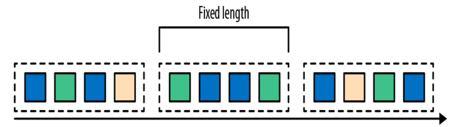

图7

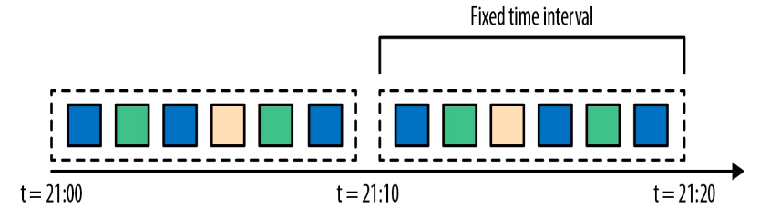

图8

2. 滑动窗口：滑动窗口将事件分配到固定大小的可重叠存储桶中，需要设置长度和步长两个属性。也像滚动窗口一样有基于数目和基于事件的两种类型。和滚动窗口不同的是，同一个事件可以属于多个滑动窗口。（图9）

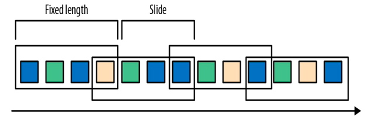

图9

3. 会话窗口：和上述两种都需要设置长度的窗口不同，会话窗口没有固定的长度。会话窗口必须是基于时间的，并且规定每两个窗口之间的时间间隔是固定的。（图10）

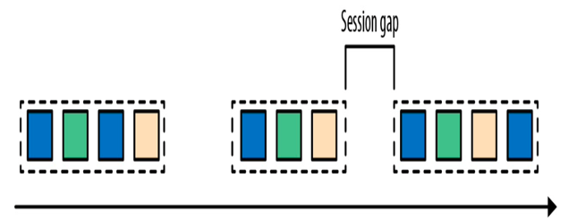

图10

### 时间语义

用一个例子来解释流数据处理中不同的时间语义：假设有一个用户在地铁中玩某个游戏，这个游戏需要在一分钟之内达到一定的分数才能过关，地铁在运行过程中会碰到一段路没有信号，这时候可能用户已经在一分钟之内达到了要求的分数但是在服务端显示的是用户超过了一分钟才得到指定分数。

* 处理时间：流处理被执行的时刻，即事件在没信号的地方被阻塞，之后到达服务器进行处理的时刻。在使用处理时间的情况下，该用户并没有过关。

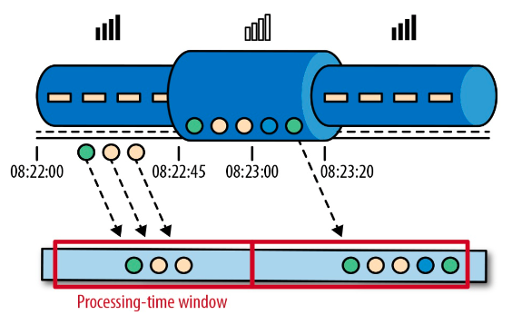

图11

* 事件时间：事件实际发生的时刻。在使用事件时间的情况下，该用户满足在一分钟内达到指定分数的条件，可以过关。

    

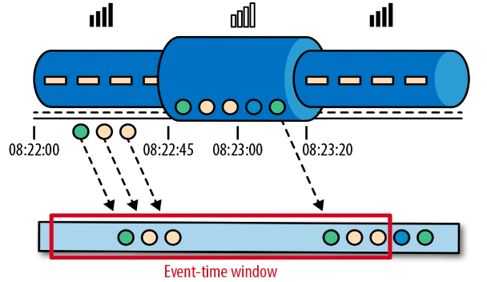

图12

​        事件时间将处理速度和得到的结果解耦，基于事件时间的操作是可预测的，结果是精确的。

### 水位线（Watermarks）

​        到目前为止，在关于事件时间窗口的讨论中，我们忽略了一个非常重要的方面：我们如何确定何时触发事件时间窗口？也就是说，我们必须等多久才能确定已经收到在特定时间点之前发生的所有事件？甚至我们怎么知道数据将被延迟？鉴于分布式系统的不可预测的现实以及外部组件可能导致的任意延迟，因此没有绝对正确的答案。我们可以配置watermarks来解决这一问题。

​        Watermarks是一个全局的进度指标，当操作接收到时间为T的watermark时，可以假定不会收到时间戳小于T的其他事件。配置watermarks需要同时考虑窗口的等待时间和置信度。若watermarks配置的过小可以确保较低的窗口等待时间，意味着在窗口中缓存的事件可以得到及时处理，但是有可能会抛弃一些应该在该窗口中，但是由于乱序还未到达的事件，即置信度比较低。若watermarks配置过大显然会大大增加延迟时间，但是置信度会增加。因此需要合理配置watermarks的值。但是有一点需要注意的是，不论watermarks如何配置，总无法达到百分之百的置信度，因此需要有合理的策略来处理那些迟到的事件，例如直接抛弃，或者使用侧输出流等方法（配合flink详细讲解）。

### 处理时间与事件时间的对比

​        处理时间提供低延迟，但是结果依赖于处理速度，并且结果不精确；事件时间提供精确的结果，并且可以处理迟到和乱序的事件。

### 状态

​        有状态的操作会在一定时间或者一定事件数量内累积状态，当事件到来时，会同时使用传入事件和内部状态来计算结果。

### 一致性模型

* 最多一次(AT-MOST-ONCE)：任务出错时事件被简单的抛弃。如果为了追求极致低延迟的话，可以采用这个语义。

* 至少一次(AT-LEAST-ONCE)：所有事件都会被处理，但是有可能被处理超过一次。如果应用的正确性只依赖于信息的完整性的情况下，重复处理可被接受。例如：从数据源和缓冲区重新读取、读取日志。
* 精确一次(EXACTLY-ONCE)：所有事件都被执行且只被执行一次。可以使用事务更新的方法，但是会带来性能问题。Flink使用轻量级快照机制来实现精确一次的语义。
* 端到端的保证(END-TO-END EXACTLY-ONCE)：保证整个数据处理管道中的结果正确性。
